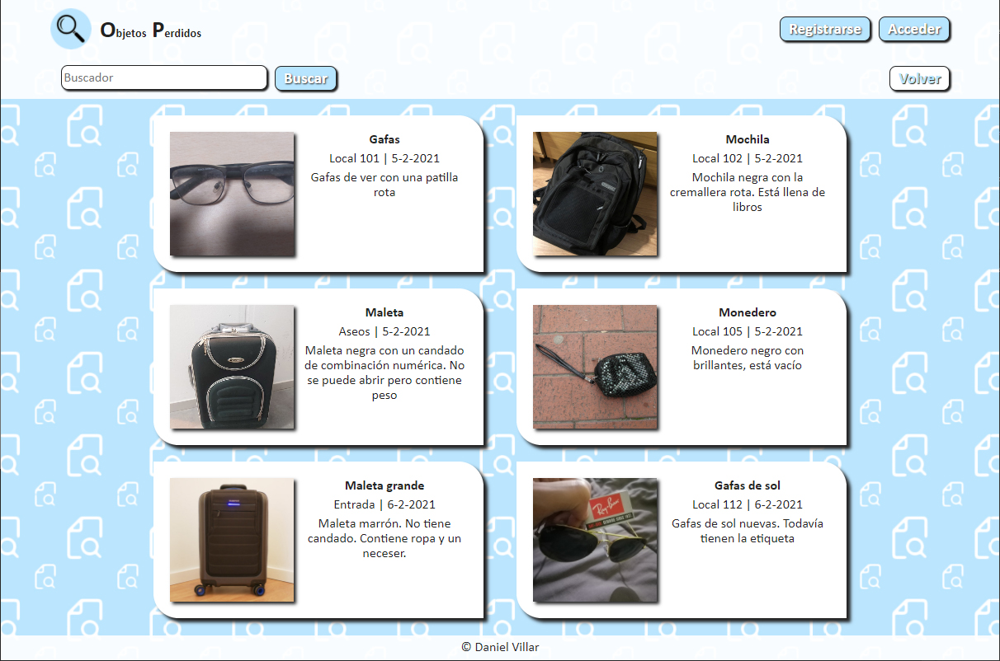

# Objetos Perdidos
__________________
Aplicación para registrar objetos perdidos. El usuario puede consultar el listado de objetos que hay en la base de datos. Adicionalmente, el usuario puede registrarse en la app e iniciar sesión, desde donde puede subir nuevos objetos o modificar sus datos de usuario.

# Caracerísticas
______________

* HTML5, CSS3, JS
* SASS
* Diseño Responsive
* [Node.js](https://nodejs.org/es/)
* [Express.js](https://expressjs.com/es/)
* [Express-handlebars](https://www.npmjs.com/package/express-handlebars)
* [Bcrypt](https://www.npmjs.com/package/bcrypt)
* [Nodemailer](https://nodemailer.com/about/)
* [MongoDB](https://www.mongodb.com/es)
* [Mongoose](https://mongoosejs.com/)
