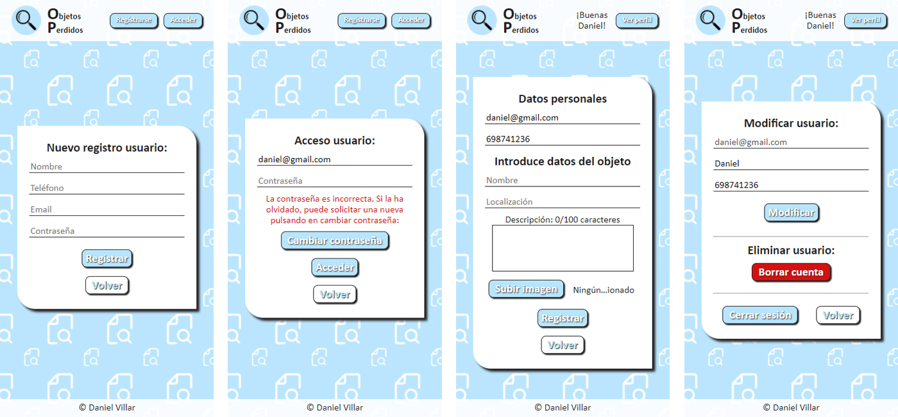

# Objetos Perdidos

## Descripción

Aplicación para registrar objetos perdidos. El usuario puede consultar el listado de objetos que hay en la base de datos. Adicionalmente, el usuario puede registrarse en la app e iniciar sesión, desde donde puede subir nuevos objetos.

La aplicación sigue los principios del diseño responsive, está en formato ordenador y móvil. El registro de usuarios se realiza con hash de contraseña y correo de confirmación. Los formularios de registro, acceso, modificación y subida de nuevos objetos realizan validaciones tanto en el front como en el back. El usuario registrado puede acceder a su perfil para modificar sus datos, eliminar su cuenta o cerrar sesión. Los datos se almacenan en una base de datos MongoDB.

## Caracerísticas

* HTML5, CSS3, JS
* SASS
* [Node.js](https://nodejs.org/es/)
* [Express.js](https://expressjs.com/es/)
* [Express-handlebars](https://www.npmjs.com/package/express-handlebars)
* [Express-session](https://www.npmjs.com/package/express-session)
* [Bcrypt](https://www.npmjs.com/package/bcrypt)
* [Nodemailer](https://nodemailer.com/about/)
* [MongoDB](https://www.mongodb.com/es)
* [Mongoose](https://mongoosejs.com/)
